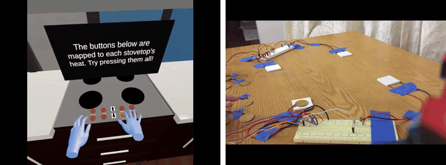
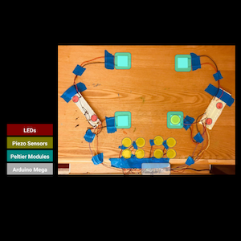
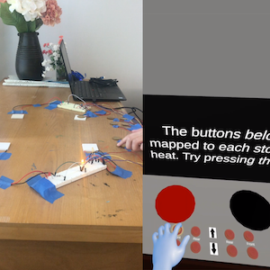
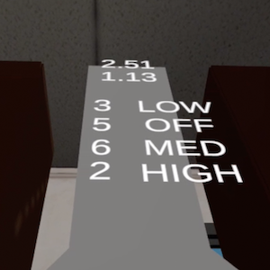

# Thermics: Evaluating Effects of Tactile Thermal Feedback on Invincibility in Virtual Reality
## Christine Ku, Amanda Trang

**Index terms**: Virtual Reality, Thermal Haptics, Presence, Perception, Invincibility

### Abstract

Virtual reality commonly stimulates the visual and auditory senses in order to prompt the user to have a level of ownership over the virtual body. In some cases, this may enable the user to behave with lowered cautiousness, knowing that there are fewer consequences to their actions. We define this type of acting with lowered cautiousness as invincibility. Additionally, haptic technology offers a wide range of feedback methods that potentially deepen the user’s sense of immersion and ownership. We chose to examine an application of thermal feedback, which can be presented as a situation with an amount of risk that has a common response in the real world, but may have varied effects in virtual reality. In particular, we will explore how virtual reality can affect a user’s sense of invincibility by prompting them to interact with hot interfaces. Physical reaction times and responses as well as levels of presence are considered to be metrics that contribute to this sense of invincibility and will be evaluated.

 | 

 | 

[Link to report](Media/readme/g04report.pdf)

[Link to video](https://drive.google.com/open?id=1-gcsuvtVwOvjVVTaeJrxmpd1gAxpzLSK)